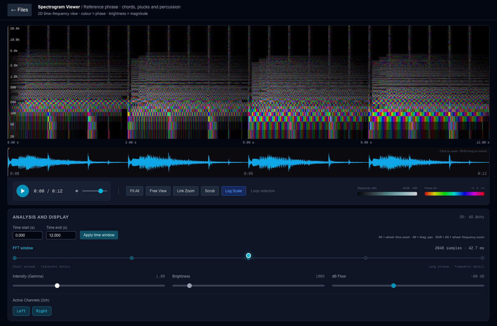

# Spectrogram Viewer

An interactive 2D spectrogram for inspecting the frequency, phase, and magnitude of audio over time.

- The horizontal axis is **time**.
- The vertical axis is **frequency**.
- **RGB colour encodes FFT phase**, from −π to +π.
- **Brightness encodes magnitude**, after decibel scaling and display adjustment.



This screenshot shows a real short-time Fourier transform (STFT) of the built-in
12-second reference phrase. The phrase contains synthesized chords, plucks, and
percussion. The waveform, playback, and spectrogram use the same audio samples.
No recording or private audio is included. See [screenshot provenance](docs/verification_15SEP2026.md).

## Run the example

Requirements: Python 3.10 or later, Node.js 20.9 or later, and a browser with WebGL2.

Start the local analysis service from the repository root:

```sh
python3 -m venv .venv
.venv/bin/python -m pip install -r backend/requirements.txt
.venv/bin/python backend/reference_backend.py --demo
```

In a second terminal, start the interface:

```sh
cd frontend
npm ci
npm run dev -- --hostname 127.0.0.1
```

Open [the local viewer](http://127.0.0.1:3000). Select the reference phrase.

On Windows, use `.venv\Scripts\python.exe` in place of `.venv/bin/python`.

## Inspect your own audio

Supply an explicit local file when you start the service. You can use a file on an external SSD.

```sh
.venv/bin/python backend/reference_backend.py --audio-file "/path/to/short_audio.wav"
```

Repeat `--audio-file` to register more clips. Add `--demo` to keep the reference
phrase available. The service reads formats supported by SoundFile, including
WAV and FLAC. It listens on the local machine and serves only registered inputs.
It does not scan your workspace or upload files.

The reference service accepts nonempty clips of at most 60 seconds and 24 million
channel samples. A transform must also fit within 8 million complex bins and
8192 texels on each axis. A shorter clip or a longer FFT window can reduce the
number of time columns. The interface reports a limit error if a transform does
not fit. This service does not implement the original long-recording cache.

## Use the controls

| Control | Effect |
| --- | --- |
| **Time start / Time end → Apply time window** | Select the visible part of the recording, in seconds. |
| **FFT window** | Change the analysis window from 512 to 8192 samples. The visible time range stays fixed. |
| **Intensity (Gamma)** | Adjust the visibility of quieter spectral detail. The default is 1. |
| **Brightness / dB Floor** | Change the display gain and lower magnitude threshold. |
| **Log Scale** | Switch between logarithmic and linear frequency axes. |
| **Fit All** | Show the full clip and frequency range. |
| **Free View / Locked View** | Keep a fixed view or follow the playhead. |
| **Left / Right / channel buttons** | Select the channels for the arithmetic mono mix used by analysis and playback. |
| **Waveform** | Click to seek. Shift-drag to select a loop region, then select **Loop selection**. |
| **Alt + wheel / Alt + drag** | Zoom in time or pan. Add Shift to wheel for frequency zoom. |

The **visible time window** and the **FFT analysis window** are different controls.
A longer FFT window separates nearby frequencies more clearly. A shorter FFT
window preserves the timing of brief events. The displayed resolutions are
separate STFTs; they are not a Laplacian residual pyramid.

[See the same recording with a 3–6 second time window](docs/time_window_detail.png).

## How it works

The reference backend uses a periodic Hann window, 75% overlap, and a centered
one-sided FFT. It returns real and imaginary arrays in frequency-by-time order.
The frontend uploads those arrays to floating-point WebGL textures.

For each complex bin `z`, the shader uses `atan2(imag(z), real(z))` for hue and
`20 × log10(abs(z))` for magnitude. It then applies the dB floor, gamma, and
brightness controls. Zero-magnitude bins are black. This is a phase-colour
display, not a wavelength-to-visible-colour conversion or calibrated luminance.

The reference backend scales interior bins to one-sided peak amplitude. A
bin-centered cosine with amplitude 1 has magnitude 1 (0 dB) away from padded
edges. DC and Nyquist bins are not doubled. Phase is relative to the start of
each FFT frame; it can change colour between frames for a steady tone.
Selected channels are averaged before the transform, so opposite-phase channels
can cancel. This viewer does not perform source separation.

See the [STFT definition in the SciPy documentation](https://docs.scipy.org/doc/scipy/reference/generated/scipy.signal.stft.html)
and [SoundFile's supported input interface](https://python-soundfile.readthedocs.io/en/latest/).

## Multi-window research

An earlier study inspected the same ten-second passage with four FFT windows.
The proposed extension combines these views to identify musical events and
guide later unmixing. Read the [multi-resolution research note](docs/multi_resolution_research.md)
for the retained figure, the three time scales, and separate recognition and
reconstruction goals.

## Service contract

The default service address is `http://127.0.0.1:8000`. Set
`NEXT_PUBLIC_ANALYSIS_URL` before starting or building the frontend to use a
compatible service at another address.

| Endpoint | Response |
| --- | --- |
| `GET /files` | Registered clip IDs, display names, duration, and sample rate. |
| `GET /audio-info?file_path=ID` | Channel count, labels, and sample rate. |
| `GET /pyramid-info?file_path=ID` | Available FFT windows and clip duration. The endpoint name is retained for frontend compatibility. |
| `GET /spectrogram?file_path=ID&M=2048` | `real_b64`, `imag_b64`, `shape`, and frame spacing. Arrays use little-endian Float32 in row-major order. |
| `GET /waveform?file_path=ID` | Min/max envelope and time positions. |
| `GET /audio-stream?file_path=ID` | PCM WAV playback with HTTP byte-range support. |

The last three endpoints accept `channels=0,1`. The spectrogram endpoint accepts
the full-clip `t_start=0` and `t_end=duration` request made by the frontend. Time
navigation samples that full texture; the reference service does not supply tiles.

## Test

```sh
.venv/bin/python -m unittest discover -s backend -v
cd frontend
npm run lint
npm run build
```

The numerical tests check frequency, amplitude, phase, silence, impulse timing,
channel cancellation, and array layout. HTTP tests check file access boundaries,
metadata, spectrum responses, and playback byte ranges. Browser verification
covers rendering, time selection, FFT changes, and playback.

## Project state

The public repository now contains the existing Next.js/Three.js frontend and a
small reference analysis service added for reproducible demonstrations. The
original private analysis service has not been recovered. The reference service
does not establish the performance of the original long-recording workflow,
spectral unmixing, or reconstruction algorithms.
