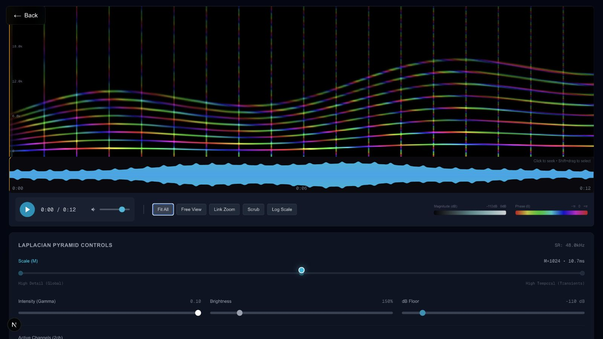

# Spectrogram Viewer

A GPU-rendered interface for exploring long or multi-channel audio through a multi-resolution complex spectrogram.
I built the viewer as the visual front end for Project Chimera audio experiments: it combines phase-aware spectral colour, a synchronized waveform and player, frequency/time navigation, and resolution controls in one full-screen workspace.

The spectrogram maps complex FFT phase to hue and magnitude to brightness. Controls expose gamma, brightness, the decibel floor, linear or logarithmic frequency scale, pyramid resolution, active channels, playhead locking, and linked time/frequency zoom.



The screenshot uses generated harmonic and transient data from a temporary
test service; it contains no source recording or private audio.

## What you can explore

- Browse audio files reported by the analysis service.
- Render real and imaginary spectral data as floating-point WebGL textures.
- Pan and zoom through time and frequency with independent or linked axes.
- Switch between linear and logarithmic frequency scales.
- Select active channels in multi-channel recordings.
- View a synchronized waveform, seek, select a time range, and follow the playhead.
- Move between analysis-pyramid levels without changing the visible time range.

## Run the frontend

Requires Node.js 20 or later.

```bash
cd frontend
npm ci
npm run dev
```

Open [http://localhost:3000](http://localhost:3000).

The repository contains the working Next.js frontend. It expects a compatible audio-analysis service at `http://localhost:8000`; the backend implementation is not part of this repository. Without that service, the interface builds and loads but cannot list or render audio files.

Verify the production build:

```bash
cd frontend
npm run build
```

## Backend contract

The frontend uses these HTTP endpoints:

| Endpoint | Purpose |
|---|---|
| `GET /files` | List available audio files with path, name, duration, and sample rate. |
| `GET /audio-info` | Report channel labels, format, subtype, and sample rate. |
| `GET /pyramid-info` | Report available analysis resolutions and duration. |
| `GET /spectrogram` | Return the selected complex spectrogram as base64-encoded `Float32` real and imaginary arrays plus shape metadata. |
| `GET /waveform` | Return downsampled time, minimum, and maximum arrays for the waveform. |
| `GET /audio-stream` | Stream the selected file and optional channel subset to the browser audio element. |

## Rendering model

`SpectrogramViewer.tsx` decodes the real and imaginary arrays into `THREE.DataTexture` objects. A fragment shader derives magnitude and phase for each bin, applies the selected decibel floor and gamma, then converts phase to HSV hue. Time and frequency windows are passed as shader uniforms, so navigation does not rebuild the source texture.

`WaveformDisplay.tsx` draws a min/max envelope on a high-DPI canvas. `AudioPlayer.tsx` supplies playback, seeking, volume, and selection-aware looping behavior. The three views share duration, current time, channel selection, and visible-window state.

## Scope

This is a research-interface prototype and a partial application boundary. It preserves the frontend used for the Chimera experiments, including its fixed local API address. It does not include the spectral-pyramid generator, audio indexing service, cache implementation, or backend tests. The current production frontend build passes; the existing stricter ESLint configuration still reports React hook and canvas-interaction issues that do not block that build.
