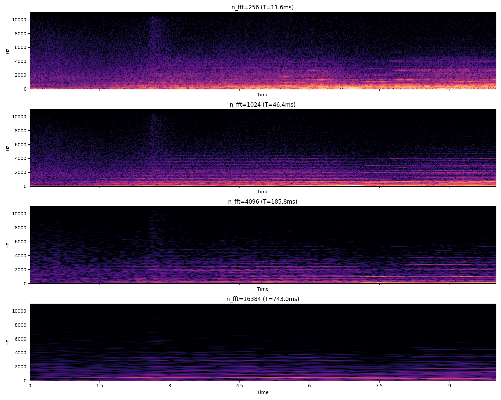

# Multi-resolution spectrogram research

The proposed next step is to read one audio passage at several FFT analysis
windows and use the combined evidence to estimate instruments, vocals, notes,
and chords over time. This is a research direction. The current application
provides the phase-colour viewer and reference analysis service.

## Earlier multi-window study

This retained historical plot shows magnitude at four FFT sizes. It is a
separate analysis figure from the RGB phase-colour application screenshot.
The underlying recording and original plotting script have not been recovered.
The image was retained unchanged; it is not a new execution or separation result.

Short windows show attacks more clearly in time. Long windows show closely
spaced frequencies more clearly. Both views can help distinguish a transient
from a sustained harmonic stack. A vertical slice spans a finite analysis
interval; several neighbouring slices provide attack, decay, and pitch context.

## Three time scales

- **Analysis window:** the audio samples used in one FFT.
- **Visible passage:** the part of the recording displayed by the viewer.
- **Model context:** the sequence of spectral frames used for an estimate.

Changing an analysis window must preserve the passage's physical time and
frequency coordinates. Scrolling should reveal cached estimates from the same
timeline. It should not redefine the source data or prediction boundaries.

## Separate outputs

| Proposed output | Evidence needed |
| --- | --- |
| Instrument and vocal activity | Labels showing which sources are active and when |
| Notes and chords | Known pitches, onsets, offsets, and harmonic labels |
| Separated audio | Time-aligned isolated stems and reconstructed waveforms |

Recognising an instrument does not determine its complete waveform. Multiple
sources can overlap in the same frequency bins. A single instrument can make
many harmonic lines, and a chord can span several instruments.

## First experiment

Use short known-source mixtures with labelled events. Compare one analysis
resolution with several aligned resolutions on the same held-out sources.
Keep recordings, instrument instances, and all their crops in the same data
split. Compare log magnitude first, then test phase features separately.
Preserve the original complex STFT for any later audio reconstruction.

RGB phase colour is useful for inspection. Its value to a model requires a
comparison: absolute phase changes with frame alignment, and display gamma,
clipping, labels, and resizing can change the image without changing the source.
Report recognition scores separately from separation and listening results.
No trained image model or measured multi-resolution gain is included here.

Spectrogram-image learning has prior research, including
[Audio Spectrogram Transformer](https://arxiv.org/abs/2104.01778) for
classification and [multi-band multi-resolution networks](https://arxiv.org/abs/1910.09266)
for singing-voice separation. These are comparison points for the proposed work.
